# AWS Bedrock API with CDK TypeScript

This project demonstrates how to build and deploy an API that leverages AWS Bedrock using the AWS CDK (Cloud Development Kit) with TypeScript.

## Prerequisites
1. Node.js v18+ installed
2. TypeScript 3.8+ installed
3. An AWS Account
4. AWS CLI v2 installed
   - [Installation guide](https://docs.aws.amazon.com/cli/latest/userguide/getting-started-install.html)
5. AWS CDK installed
   - [Installation guide](https://docs.aws.amazon.com/cdk/v2/guide/getting_started.html#getting_started_install)
6. Fork this repository, make sure it is <Your-Name>/cdk-bedrock-app

## Getting Started

1. Install dependencies from the root directory
```
npm install
```

2. Create a Github Access Token

- 2a. Navigate to Github -> Settings -> Developer Settings -> Personal Access Tokens -> Tokens (classic)

- 2b. Click `Generate new token (classic)` and select the following settings:
  - repo (check so all children checks are enabled too)
  - admin:repo_hook (check so all children checks are enabled too)

- 2c. Put the token in AWS SecretsManager
  - NOTE: Make sure you are in us-east-1
  - Navigate to the AWS Console and click on SecretsManager, click on `Store a new secret`
  - `Other type of secret` -> `Plaintext`
  - Delete the JSON object and paste in the Github Access Token from the previous step
  - Name the token, you can keep it as `github-token`
  - No rotation or other configurations for now

- 2d. Follow the steps above (in 2c) to place in this plaintext value into SecretsManager
  - NOTE: Make sure you are in us-east-1
  - Secret name: `cdk-default-account`
  - Secret plaintext value: <your AWS Account ID, found in the top right corner of the console>

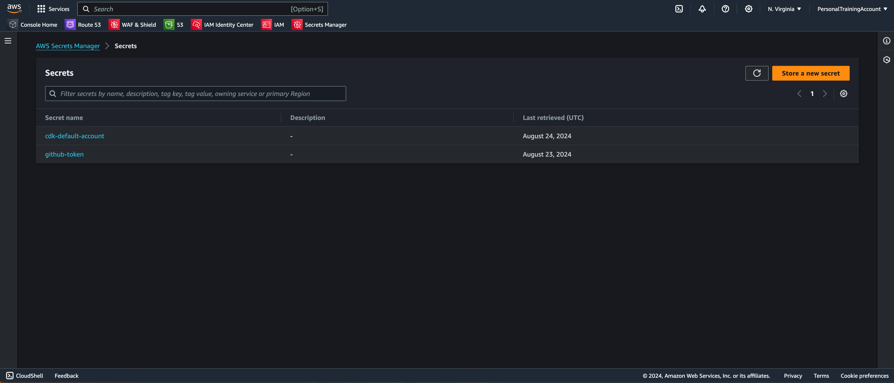

3. Get AWS Bedrock Access

- NOTE: Make sure you are in us-east-1

Naviagte to Bedrock in the AWS Console, and towards the bottom left find `Model access` and get all model access
NOTE: This repo uses Anthropic Claude3 Haiku, so it is important to get that model (unless you want to change it)

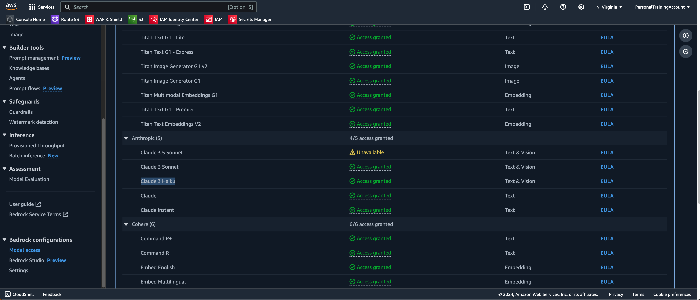

4. Create an IAM user for you to grant access to deploy
NOTE: It is better to use AWS SSO to manage your users, but in the interest of time we are making a very simplified user to test locally.

- 4a. Navigate to the IAM section within the AWS Console and click on `Users`
- 4b. Click `Create User`, give it a name that you will remember (in my case, it's `alex_cs_cli`), and do NOT click `Provide user access to the AWS Management Console`
- 4c. For simplicity, just select `Attach Policies Directly` and grant `AdministratorAccess`
- 4d. Click `Create User`
- 4e. Navigate to that new user and click `Create access key`
- 4f. Select the Command Line Interface use case and tick the box for "I understand the above..." and save those keys securely somewhere

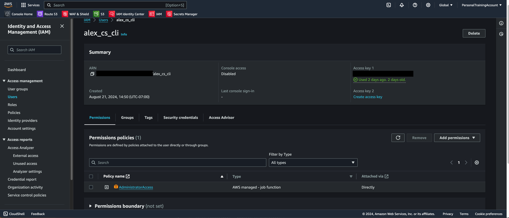

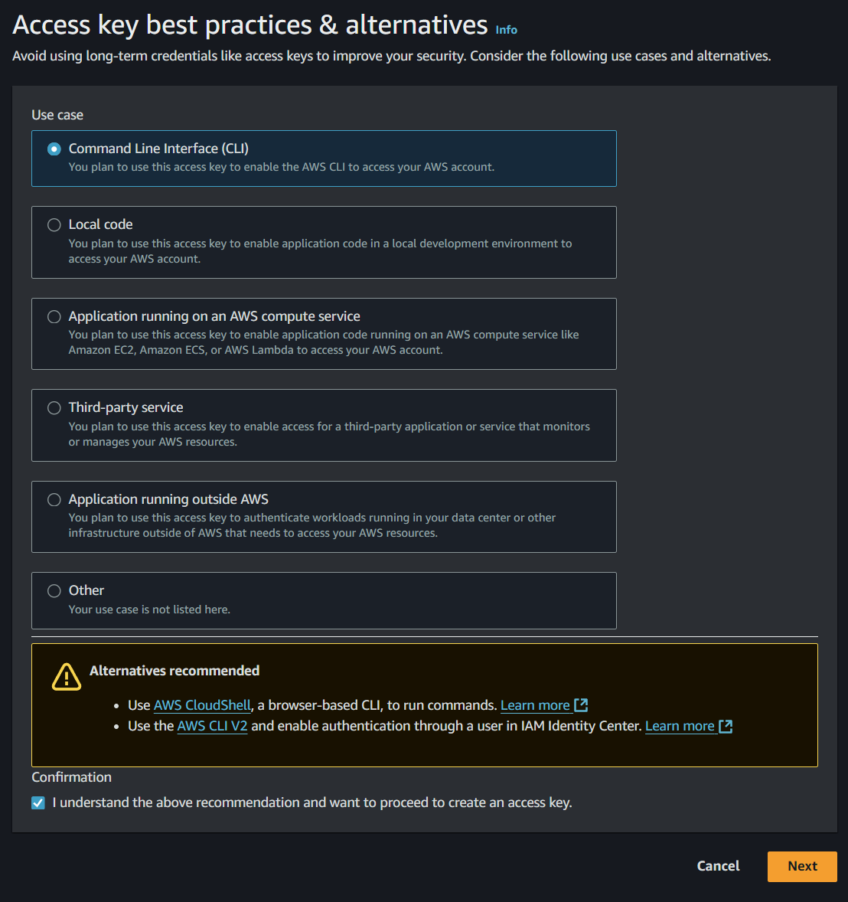

5. Configure your AWS profile locally
- 5a. Run `aws configure --profile <insert name here>` in your terminal
- 5b. Paste in the AccessKey and SecretAccessKey from the step before
- 5c. `us-east-1` and `json` respectively, all lowercase
- 5d. run `aws iam list-users --profile <insert name here>` to check that you have authenticated properly. This command does nothing other than ensure you are not seeing errors.


6. Configure your specific repo and region values in your code

- 6a. Adjust these lines for your repo
lib/cdk-pipeline-stack.ts
```
const cdkDefaultRegion = "us-east-1";
const githubRepo = "Alexander-Infante/cdk-bedrock-app";
```

- 6b. !! Git add, git commit, and git push to your `main` branch- this is very important before the next step!

7. Deploy the pipeline:
- 7a. CDK Bootstrap for your AWS Account
```
cdk bootstrap --profile <insert name here>
```
- 7b. CDK Synth to check everything
```
cdk synth --profile <insert name here>
```
- 7c. CDK Deploy the stack
```
cdk deploy --profile <insert name here>
```

8. Monitor CloudFormation for the CodePipeline Stack
Navigate over the the AWS Console -> CloudFormation to ensure the CodePipeline Stack deploys properly. I like to monitor the `Events` tab.
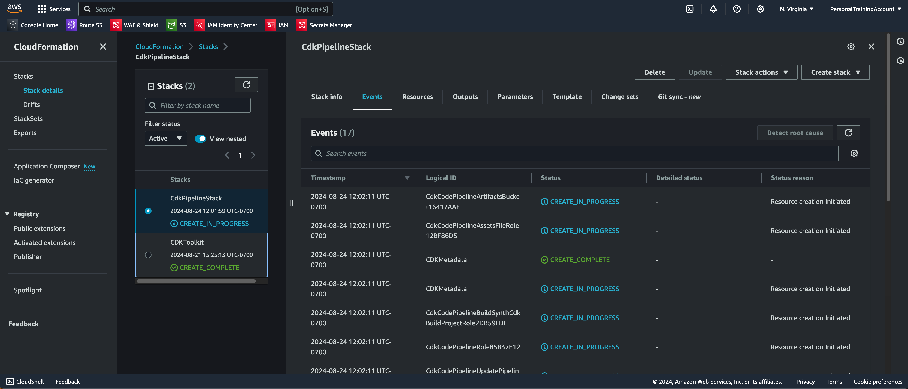


9. Monitor CodePipeline Deployment
You can see your CI/CD Pipeline by navigating to the AWS Console -> CodePipeline => `CdkCodePipeline`
Note the steps that it takes to deploy your application and ensure each of them succeeds. For now, let's make sure this works up to our `Dev` Environment and proceed with testing. Once that passes, we can promote this to our `Production` environment.

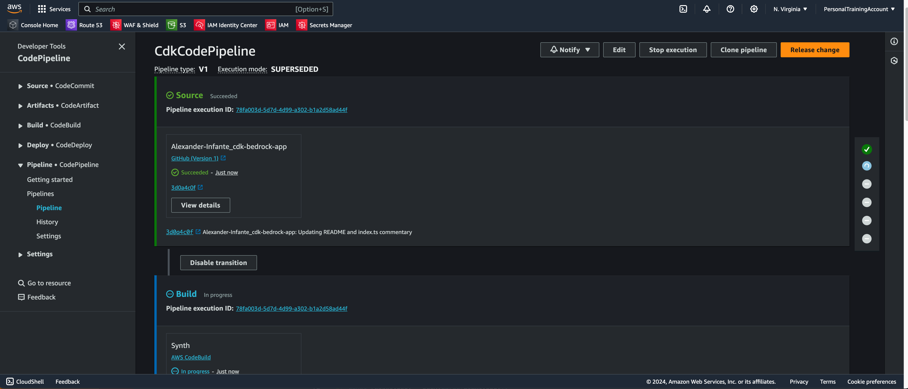

10. Monitor CloudFormation for the CdkBedrockAppStack
Similar to the steps above, monitor CloudFormation (I prefer to look at `Events`) to ensure your deployment succeeds for the main CDK Bedrock App Stack.
NOTE that this stack is a stand alone for the `Dev` environment.
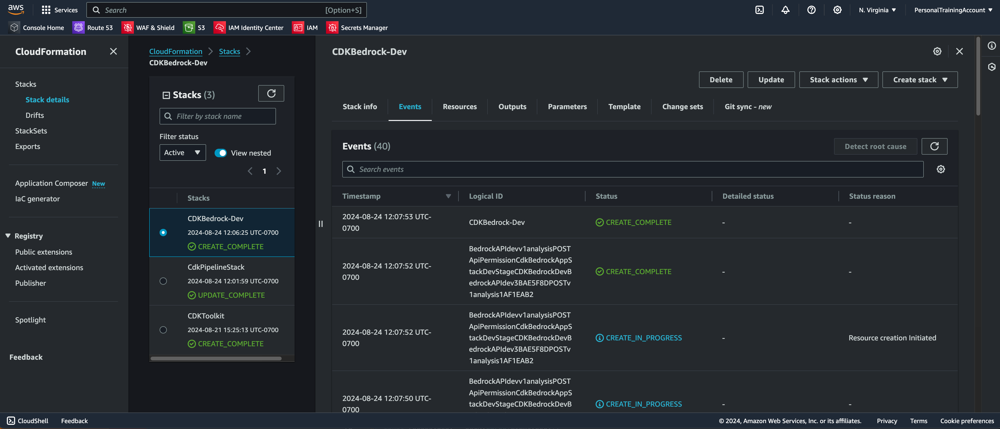


11. API Gateway
Now we navigate over the the AWS Console -> API Gateway -> Bedrock API dev -> Stages
Here we can see the `Dev` stage for our API Gateway, and are able to copy the `Invoke URL` for testing in the next step.
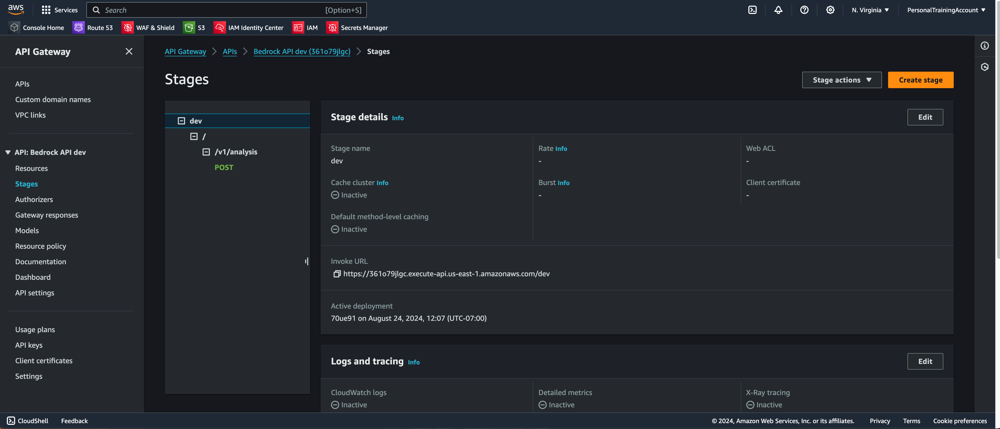

12. Postman/ cURL request to `POST`  <Invoke URL> + `/v1/analysis` with a request body

Sample request body
```
{
  "inputData": {
    "kubernetes_cluster_metrics": [
      {
        "cluster_name": "prod-cluster-1",
        "node_count": 10,
        "cpu_usage_percent": 68.5,
        "memory_usage_percent": 75.2,
        "pod_count": 87,
        "timestamp": "2024-08-23T14:30:00Z"
      },
      {
        "cluster_name": "dev-cluster-2",
        "node_count": 5,
        "cpu_usage_percent": 42.3,
        "memory_usage_percent": 58.7,
        "pod_count": 35,
        "timestamp": "2024-08-23T14:30:00Z"
      },
      {
        "cluster_name": "staging-cluster-1",
        "node_count": 7,
        "cpu_usage_percent": 55.1,
        "memory_usage_percent": 63.9,
        "pod_count": 62,
        "timestamp": "2024-08-23T14:30:00Z"
      },
      {
        "cluster_name": "prod-cluster-2",
        "node_count": 12,
        "cpu_usage_percent": 78.9,
        "memory_usage_percent": 82.4,
        "pod_count": 105,
        "timestamp": "2024-08-23T14:30:00Z"
      },
      {
        "cluster_name": "test-cluster-1",
        "node_count": 3,
        "cpu_usage_percent": 25.7,
        "memory_usage_percent": 40.3,
        "pod_count": 18,
        "timestamp": "2024-08-23T14:30:00Z"
      }
    ]
  }
}
```

13. Monitor AWS Lambda and Cloudwatch

We can navigate over the Lambda Console, find our `*QueryBedrockLambdaFunctiondev*` function and click `Monitor`. We can also view the CloudWatch logs and see the logging we have in place. For now, we are just using simple logging. You can look into Winston Logger, Lambda Power Tools, or other extensions to help improve your overall logging.

14. Improve the prompt and push those changes to the `main` branch to redeploy into Staging

```
const prompt = `You are an expert Kubernetes cluster analyst.
Your task is to analyze and summarize the provided Kubernetes cluster metrics data.

Here's the data:
${JSON.stringify(requestBody.inputData, null, 2)}

Please provide a comprehensive summary of this data, including:

1. Overview:
   - Total number of clusters
   - Total number of nodes across all clusters
   - Total number of pods across all clusters

2. Cluster Analysis:
   - For each cluster, provide:
     a) Cluster name
     b) Number of nodes
     c) Number of pods
     d) CPU usage percentage
     e) Memory usage percentage

3. Resource Utilization:
   - Identify the cluster with the highest CPU usage
   - Identify the cluster with the highest memory usage
   - Calculate and report the average CPU and memory usage across all clusters

4. Scale and Performance:
   - Rank the clusters from largest to smallest based on node count
   - Analyze the relationship between node count and pod count
   - Identify any clusters that might be under or over-utilized based on their metrics

5. Recommendations:
   - Suggest any potential optimizations or areas of concern based on the data
   - Identify which clusters might need scaling up or down

6. Timestamp Analysis:
   - Comment on the timestamp of the data and its relevance

Please provide your analysis in a clear, structured format using markdown for better readability.`;
```

15. Promote to Production

Finally, if everything above has succeeded, we can navigate back to CodePipeline -> Pipelines -> `CdkCodePipeline`
Now we can scroll down to the `ProductionStage` where we see `PromoteToProd` as a Manual Approval Step. Click `Review`, and you can approve this. This will now create an entirely new CloudFormation Stack for your Production environment, which you can use with real users.

16. Build even more!

The beauty of this CDK Application is that you can add so much more to it, from something as simple as enhancing your prompt in the Lambda function to creating entire APIs around this by adding in databases, IoT Pub/ Sub, S3 buckets, more Lambdas for additional functionality, authentication/ authorization, and so much more. This is just the initial building foundation for you to continuously add on and make this a full fledged product.


## Architecture Overview
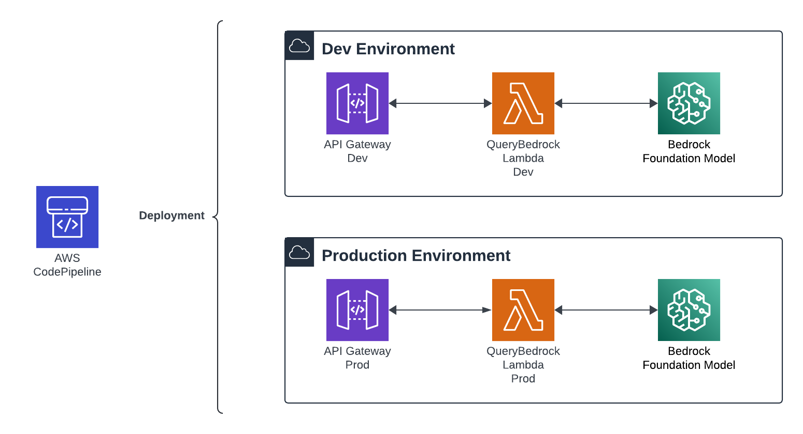

## How this works with your application
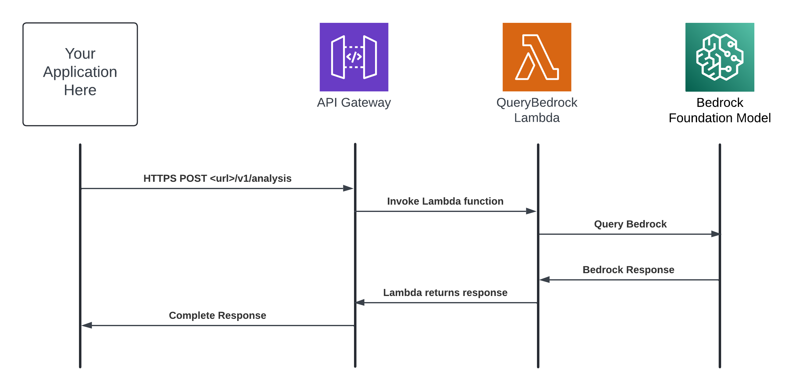

## What is AWS CDK?

The AWS CDK (Cloud Development Kit) is an open-source software development framework to define cloud infrastructure in code and provision it through AWS CloudFormation. It allows you to use familiar programming languages to model your applications.

Key benefits:
- Use programming languages you're familiar with (TypeScript, JavaScript, Python, etc.)
- Leverage object-oriented techniques to create reusable infrastructure components
- Use high-level constructs that preconfigure cloud resources with proven defaults

## What is AWS Bedrock?

AWS Bedrock is a fully managed service that provides easy access to high-performing foundation models (FMs) from leading AI companies. It allows you to:

- Build generative AI applications without having to manage the underlying infrastructure
- Choose from a variety of models for tasks like text generation, summarization, and more
- Customize models to your specific use case

## Project Structure

```
.
├── bin/
│   └── cdk-bedrock-pipeline.ts    # CDK app entry point
├── lib/
│   ├── cdk-pipeline-stack.ts      # Defines the CI/CD pipeline
│   ├── cdk-bedrock-app-stack.ts   # Defines the main application stack
│   └── lambdas/
│       └── queryBedrock/
│           └── index.ts           # Lambda function to query Bedrock
├── test/
│   └── cdk-bedrock-pipeline.test.ts
├── .env                           # Environment variables (git-ignored)
├── cdk.json
├── package.json
├── tsconfig.json
└── README.md
```

## How It Works

1. The `CdkPipelineStack` sets up a CI/CD pipeline using AWS CodePipeline.
2. The pipeline automatically deploys the `CdkBedrockAppStack` to dev and prod environments.
3. The `CdkBedrockAppStack` creates:
   - An API Gateway
   - A Lambda function (`queryBedrockLambda`)
   - Necessary IAM permissions for the Lambda to access Bedrock
4. When the API receives a POST request at `/v1/analysis`, it triggers the Lambda.
5. The Lambda function sends the request data to Bedrock for analysis.
6. Bedrock processes the data and returns a summary.
7. The Lambda function returns this summary as the API response.

## Top K and Top P Values Explained

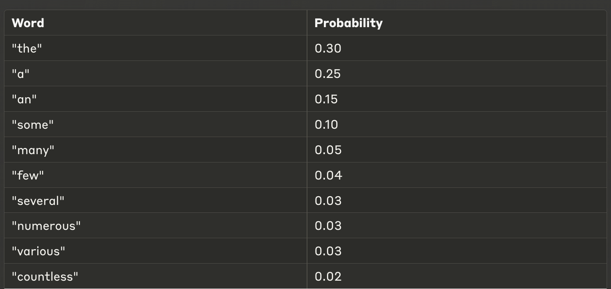

Top K
* The top number of words that are selected (ex. "top 5 when ranked by probability")

Top P/ Nucleus Sampling
* Cumulative probability grouped together to further refine the group

## Useful Commands

* `npm run build`   Compile TypeScript to JS
* `npm run watch`   Watch for changes and compile
* `npm run test`    Perform the jest unit tests
* `npx cdk deploy`  Deploy this stack to your default AWS account/region
* `npx cdk diff`    Compare deployed stack with current state
* `npx cdk synth`   Emits the synthesized CloudFormation template

## Further Learning

- [AWS CDK Documentation](https://docs.aws.amazon.com/cdk/latest/guide/home.html)
- [AWS Bedrock Documentation](https://docs.aws.amazon.com/bedrock/latest/userguide/what-is-bedrock.html)
- [TypeScript Documentation](https://www.typescriptlang.org/docs/)

## Troubleshooting

If you encounter issues:
1. Ensure your AWS credentials are correctly set up
2. Check that you've enabled AWS Bedrock in your account
3. Verify that your .env file contains the correct account and region information

For more help, consult the AWS CDK and Bedrock documentation or reach out to AWS support.